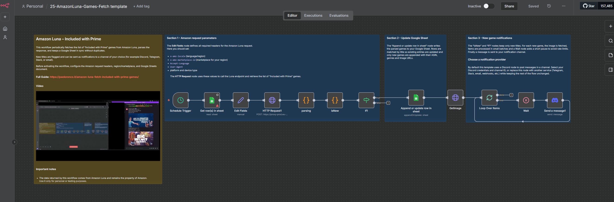

# Sync Amazon Luna Prime Games to Google Sheets with Automatic Updates

## Quick Overview

Automatically fetch Amazon Luna games included with Prime, detect newly added titles, synchronize the catalog with Google Sheets, and optionally send Discord notifications when new games become available.

## How It Works

- **Scheduled refresh** — The workflow runs every five days at 3:00 PM by default; the schedule can be changed in n8n.
- **Amazon Luna fetch** — An HTTP Request calls the Luna backend with configurable locale and marketplace headers to retrieve the current Included with Prime catalog.
- **Game parsing** — JavaScript extracts structured metadata including ASIN, title, release year, publishers, genres, product URL, images, and age rating.
- **New-game detection** — Retrieved titles are compared with Google Sheets records, primarily by ASIN and with title as a fallback.
- **Google Sheets sync** — Games are appended or updated in the selected sheet to keep the catalog synchronized without duplicate records.
- **Discord notification** — Newly detected games can be filtered, batched, and sent to Discord with game details and artwork.

## Setup

- **Import the workflow** — Import `workflow.json` into n8n.
- **Configure Amazon headers** — Update the Edit Fields node with the locale, marketplace ID, Origin, Referer, Accept-Language, and User-Agent for your target Amazon region.
- **Connect Google Sheets** — Configure credentials, document, and sheet for reading the existing catalog and writing synchronized records.
- **Configure Discord** — Connect Discord OAuth2 and select the target server and channel, or remove/replace this branch if notifications are not required.
- **Review the schedule** — Keep the default five-day interval or choose your preferred refresh frequency.
- **Activate the workflow** — Run a manual test, verify rows and notifications, then activate it.

## Requirements

- n8n instance
- Google Sheets account and credentials
- Google Sheet used as the game catalog
- Network access to the Amazon Luna endpoint

### Optional

- Discord account and n8n Discord OAuth2 credentials
- Alternative notification service such as Telegram, Slack, email, or webhook
- Additional branches for multiple Amazon marketplaces

## Customization

- **Region** — Change locale, marketplace ID, Origin, Referer, and language headers for another supported marketplace.
- **Schedule** — Adjust how often the Luna catalog is refreshed.
- **Stored metadata** — Extend or reduce fields extracted by the Code node and mapped to Google Sheets.
- **Notifications** — Replace Discord with another n8n-supported messaging, email, or webhook integration.
- **Multi-region tracking** — Duplicate the fetch, parsing, synchronization, and notification logic for separate regional catalogs.

## Additional Info

- [Full deployment guide](https://paoloronco.it/amazon-luna-fetch-included-with-prime-games/)
- [Video guide](https://youtu.be/PS6qdCbc5fU)
- [n8n Community Template](https://n8n.io/workflows/10733-sync-amazon-luna-prime-games-to-google-sheets-with-automatic-updates/)
- Additional technical notes are available in the `docs/` directory.
- Amazon may change Luna endpoints or request requirements; review the request configuration if fetching stops working.
- Amazon data remains subject to Amazon's applicable terms and policies.
