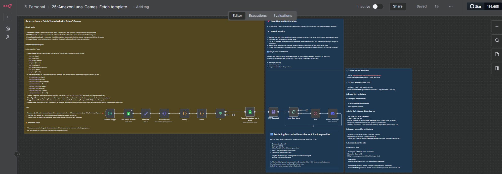

# Fetch Amazon Luna Games and send Discord notifications

### Auto-Sync “Included with Prime” Games → Google Sheets with Discord Notifications

This n8n workflow automatically fetches, parses, and keeps updated the full catalog of **Amazon Luna – Included with Prime** games.  
The workflow retrieves metadata directly from Amazon’s backend, cleans the results, and writes everything into Google Sheets without duplicates.

Full deploy guide:  [Amazon Luna – Fetch “Included with Prime” Games &#8211; Paolo Ronco](https://paoloronco.it/amazon-luna-fetch-included-with-prime-games/)

Video: [Amazon Luna – Fetch “Included with Prime” Games - YouTube](https://youtu.be/PS6qdCbc5fU)

---

## ⭐ Features

- Automatically fetch the complete “Included with Prime” catalog  
- Extract full metadata: title, genres, release year, ASIN, images  
- Auto-sync to Google Sheets (append or update)  
- Prevent duplicates using a unique key  
- Detect NEW games and send notifications (Discord, Telegram, etc.)  
- Supports multiple countries (IT, US, DE, FR, ES, JP…)  
- Clean, modular, fully customizable workflow

---

## 🧩 Workflow Overview

1. **Schedule Trigger**  
   Runs every 5 days at 3:00 PM (you can change interval & time).

2. **HTTP Request → Amazon Luna**  
   Calls the Luna backend endpoint and downloads the "Included with Prime" list.

3. **Parsing (JavaScript Code)**  
   Extracts all metadata from GAME_TILE blocks:
   
   - Title  
   - Release Year  
   - Genres  
   - Publishers  
   - ASIN  
   - Slug  
   - Portrait & Landscape images  
   - Product URLs  

4. **Google Sheets Sync**  
   Each item is inserted or updated depending on whether it already exists.

5. **Optional: Notifications**  
   When new games appear, the workflow fires a message (Discord, Telegram, Email…).

---

## ⚙️ Configuration Parameters

| Parameter                | Description            | Examples                                                               |
| ------------------------ | ---------------------- | ---------------------------------------------------------------------- |
| **x-amz-locale**         | Language/Region        | `it_IT`, `en_US`, `de_DE`, `fr_FR`, `es_ES`, `en_GB`, `ja_JP`, `en_CA` |
| **x-amz-marketplace-id** | Marketplace backend ID | `APJ6JRA9NG5V4` 🇮🇹, `ATVPDKIKX0DER` 🇺🇸, `A1PA6795UKMFR9` 🇩🇪, …   |
| **Accept-Language**      | Response language      | `it-IT,it;q=0.9,en;q=0.8`                                              |
| **User-Agent**           | Browser UA             | Your current browser UA                                                |
| **Trigger interval**     | Refresh frequency      | Default: 5 days @ 15:00                                                |
| **Google Sheet**         | Where data is stored   | Select document + sheet                                                |

You may duplicate the block (Edit Fields → HTTP Request → Parsing → Sheets) to track multiple countries.

---

## 🔔 Notifications (Optional)

This workflow can automatically send alerts for new games.

Supported outputs:

- Discord (official bot or webhook)
- Telegram Bot API
- Email (SMTP)
- Slack / Microsoft Teams / Matrix / Bark
- Any Webhook

For a complete guide, see **notes-notify.md** in this folder.

---

## 📁 Files Included

- `workflow.json` → the complete n8n workflow  
- `README.md` → this file  
- `notes-fetch.md` → fetch logic, headers, parsing  
- `notes-notify.md` → notifications logic & setup  
- `assets/overview.png` → optional preview image  

---

## 🗎 Extra Docs

- [Fetch Notes](docs/NOTES-Fetch.md)
- [Notify Notes](docs/NOTES-Notify.md)

---

## 🔒 Important Notes

- All data belongs to Amazon.  
- This workflow is for **personal / testing / educational** use only.  
- Do **not** republish or redistribute the full game list.  
- Amazon may change internal APIs anytime, so re-check headers/body when needed.

---
