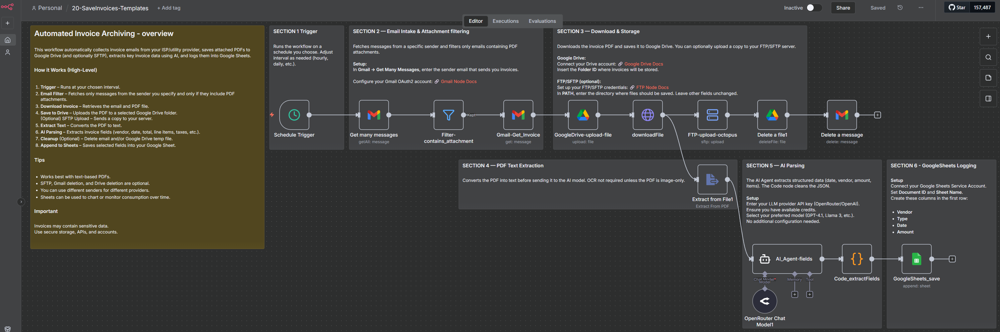

# Automated Invoice Archiving and AI Data Extraction

## Quick Overview

Automatically collect invoice PDFs from Gmail, archive them in Google Drive or an optional FTP/SFTP server, extract structured invoice data with AI, and record the results in Google Sheets.

## How It Works

- **Scheduled inbox check** — A Schedule Trigger periodically checks Gmail for invoice messages matching the configured sender and attachment filters.
- **Invoice download** — Gmail nodes retrieve the matching message and download its PDF attachment.
- **Document archiving** — The PDF is uploaded to Google Drive and can optionally be copied to an FTP/SFTP server.
- **Text extraction** — n8n extracts text from text-based PDFs for AI processing without requiring OCR.
- **AI extraction** — An OpenRouter-backed AI Agent extracts structured fields such as vendor, invoice number, date, amount, tax information, line items, and purchase-order data.
- **Output normalization** — A Code node cleans and parses the model response into usable JSON.
- **Google Sheets logging** — Extracted invoice fields are appended to the configured spreadsheet.
- **Optional cleanup** — The processed Gmail message and temporary Google Drive file can be removed when no longer required.

## Setup

- **Import the workflow** — Import `Email_Invoices-AI_Extraction-Archiving.json` into n8n.
- **Connect Gmail** — Configure Gmail OAuth2 and update sender/message filters for the providers you want to process.
- **Connect Google Drive** — Configure Drive OAuth2 and select the destination folder for invoice PDFs.
- **Configure OpenRouter** — Add OpenRouter credentials and select the model used by the extraction agent.
- **Connect Google Sheets** — Select the spreadsheet, configure credentials, and map extracted fields to its columns.
- **Review optional storage and cleanup** — Configure FTP/SFTP if required and enable deletion steps only when intentionally removing source or temporary files.
- **Test and activate** — Process a sample invoice, verify the PDF and extracted fields, then activate the workflow.

## Requirements

- n8n instance
- Gmail account with OAuth2 credentials
- Google Drive account with OAuth2 credentials
- Google Sheets document and credentials
- OpenRouter account/API credentials
- Text-based PDF invoices for direct text extraction

### Optional

- FTP/SFTP server and credentials
- Multiple sender filters for different invoice providers
- Additional Google Sheets reporting or dashboard logic

## Customization

- **Invoice sources** — Add or change Gmail filters for multiple utilities, ISPs, vendors, or providers.
- **Storage destination** — Keep Google Drive, add FTP/SFTP, or adapt the flow to another supported storage service.
- **AI model** — Change the OpenRouter model according to quality, latency, and cost requirements.
- **Extracted fields** — Modify the AI prompt, JSON parsing, and Sheets mappings for your required invoice data.
- **Retention behavior** — Keep or remove Gmail messages and temporary Drive files according to your archival requirements.
- **Schedule** — Change how frequently the inbox is checked.

## Additional Info

- [Full deployment guide](https://paoloronco.it/n8n-template-automated-invoice-archiving/)
- Invoice documents may contain personal and financial information. Protect credentials, storage locations, spreadsheets, and FTP/SFTP access appropriately.
- AI extraction accuracy depends on document structure and the selected model. Validate extracted data before using it for accounting or fiscal processes.
- This workflow is an automation aid, not a replacement for legally compliant fiscal or document-retention systems.
