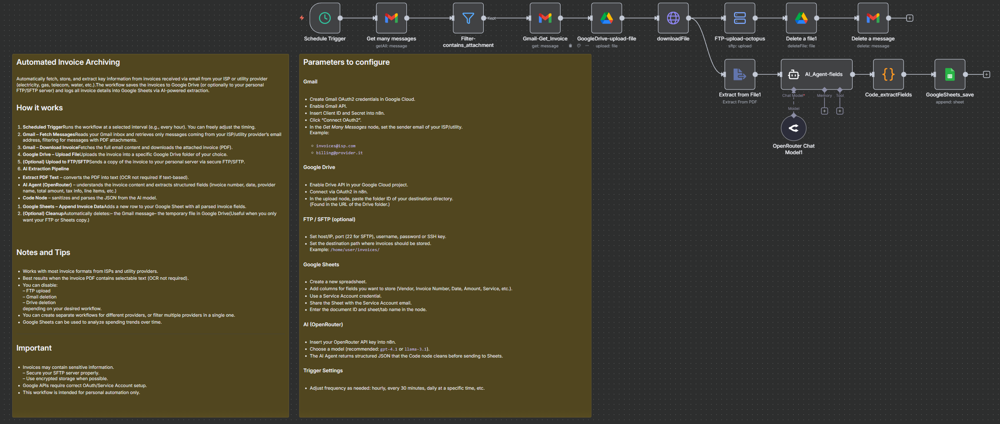

# Automated Invoice Archiving

Automatically fetch, store, and extract key information from invoices received via email from your ISP or utility provider (electricity, gas, telecom, water, etc.).  
The workflow saves the invoices to Google Drive (or optionally to your personal FTP/SFTP server) and logs all invoice details into Google Sheets via AI-powered extraction.

### How it works

1. **Scheduled Trigger**  
   Runs the workflow at a selected interval (e.g., every hour). You can freely adjust the timing.

2. **Gmail – Fetch Messages**  
   Reads your Gmail inbox and retrieves only messages coming from your ISP/utility provider’s email address, filtering for messages with PDF attachments.

3. **Gmail – Download Invoice**  
   Fetches the full email content and downloads the attached invoice (PDF).

4. **Google Drive – Upload File**  
   Uploads the invoice into a specific Google Drive folder of your choice.

5. **(Optional) Upload to FTP/SFTP**  
   Sends a copy of the invoice to your personal server via secure FTP/SFTP.

6. **AI Extraction Pipeline**
   
   * **Extract PDF Text** – converts the PDF into text (OCR not required if text-based).
   
   * **AI Agent (OpenRouter)** – understands the invoice content and extracts structured fields (invoice number, date, provider name, total amount, tax info, line items, etc.)
   
   * **Code Node** – sanitizes and parses the JSON from the AI model.

7. **Google Sheets – Append Invoice Data**  
   Adds a new row to your Google Sheet with all parsed invoice fields.

8. **(Optional) Cleanup**  
   Automatically deletes:  
   – the Gmail message  
   – the temporary file in Google Drive  
   (Useful when you only want your FTP or Sheets copy.)
   
   

Parameters to configure
-----------------------

| Parameter                                | Description                                          | Recommended configuration                                                                                                   |
| ---------------------------------------- | ---------------------------------------------------- | --------------------------------------------------------------------------------------------------------------------------- |
| **Gmail Credentials**                    | OAuth2 credentials needed to read and delete emails. | Create OAuth credentials on Google Cloud → enable Gmail API → paste Client ID & Secret into n8n → “Connect OAuth2”.         |
| **Sender Email Filter**                  | Email address your provider uses to send invoices.   | Example: `billing@your-isp.com`, `invoices@utility.it`, `ciao@octopusenergy.it`                                             |
| **Google Drive Folder**                  | Destination folder for saving invoices.              | Copy the folder ID from the Drive URL and paste it into `folderId`.                                                         |
| **Google Drive Credentials**             | OAuth2 connection for file uploads/deletions.        | Same Google Cloud project → enable Drive API → OAuth connect in n8n.                                                        |
| **FTP/SFTP Server (optional)**           | Upload invoices to your private server.              | Host / IP · Port · Username · Password or SSH Key · Destination path (e.g. `/home/user/invoices/`).                         |
| **AI Model (OpenRouter)**                | Large-language model used to parse invoice text.     | Example: `gpt-4.1`, `llama-3.1`, or any preferred OpenRouter model.                                                         |
| **Google Sheets Document**               | Destination spreadsheet for structured data.         | Create a Sheet → add columns (Vendor, Invoice Number, Date, Amount, Service Type, etc.) → insert `documentId` & sheet name. |
| **Sheets Credentials (Service Account)** | Used for writing into Google Sheets.                 | Create Service Account → download JSON → add to n8n → share the Sheet with the Service Account email.                       |
| **Trigger Interval**                     | How often the workflow checks for new invoices.      | Every hour · every 30 minutes · daily at set ti                                                                             |

Node-by-node breakdown
----------------------

### **1. Schedule Trigger**

Runs at the interval you choose (default: hourly).  
Start → triggers entire workflow.

* * *

### **2. Gmail – Get Many Messages**

Filters inbox items using:

* **Sender email** (your ISP/utility address)

* **Has attachment**

* **Unread or recent messages**

Downloads metadata + attachment references.

* * *

### **3. Filter – Contains Attachment**

Ensures only messages with binary attachments continue.

* * *

### **4. Gmail – Get Invoice**

Downloads:

* Full email JSON

* The invoice PDF (binary data)

* * *

### **5. Google Drive – Upload File**

Uploads invoice PDF with a dynamic filename:

`{{ $json.from.value[0].name }}-{{ $json.date }}.pdf`

Requires:

* Google Drive OAuth2 credentials

* Folder ID (destination directory)

* * *

### **6. HTTP Request – Download File**

Retrieves the raw PDF file from Google Drive for further processing.

* * *

### **7. (Optional) FTP/SFTP Upload**

Uploads the PDF to your server using:

* Host / IP

* Port (default 22)

* Username

* Password or private key

* Destination path

Filename is sanitized to ensure Unix compatibility.

* * *

### **8. (Optional) Delete Temporary File**

Deletes the Google Drive file if you don’t want duplicates.

* * *

### **9. (Optional) Delete Gmail Message**

Removes the original email once processed (optional inbox cleanup).

* * *

### **10. Extract from File (PDF → Text)**

Reads the PDF and extracts raw text for AI processing.

* * *

### **11. OpenRouter Chat Model**

LLM backend for the AI agent. Provides:

* invoice parsing

* field extraction

* structured reasoning

* * *

### **12. AI Agent – Extract Invoice Fields**

The agent is instructed to return **strict JSON only**, containing keys such as:

* `vendor_name`

* `invoice_number`

* `invoice_date`

* `total_amount`

* `tax_details`

* `line_items[]`

* `po_number`

* `po_date`

Works for most standard PDF invoices.

* * *

### **13. Code – Clean & Parse JSON**

Sanitizes the AI output:

* Removes markdown fences

* Extracts valid JSON

* Parses into a clean JS object

If the AI output is malformed, debugging info is returned.

* * *

### **14. Google Sheets – Append Data**

Appends the extracted fields into a structured row.  
Example mappings:

* **Vendor** → `{{ $json.vendor_name }}`

* **Invoice Number** → `{{ $json.invoice_number }}`

* **Date** → `{{ $json.invoice_date }}`

* **Amount** → `{{ $json.total_amount }}`

* **Service Type** → `{{ $json.line_items[0].description }}`

* * *

💡 Tips & best practices
------------------------

* Add multiple sender filters if you have **more than one utility provider**.

* Ensure invoices are **text-based PDFs** for best extraction results.

* Use Google Drive as a reliable long-term archive, or keep only FTP if you prefer local storage.

* Create charts in Google Sheets for tracking:
  
  * Monthly utility cost trends
  
  * Year-over-year comparison
  
  * Consumption spikes (if included in invoices)

* * *

⚠️ Important notes
------------------

* Utility invoices contain **personal and financial data**. Keep your FTP/SFTP server secure.

* Google APIs require proper OAuth2 or Service Account setup; misconfiguration may cause permission errors.

* This workflow is for **personal automation**, not a replacement for official fiscal archiving.

* AI extraction quality depends on invoice formatting and the model you choose.

