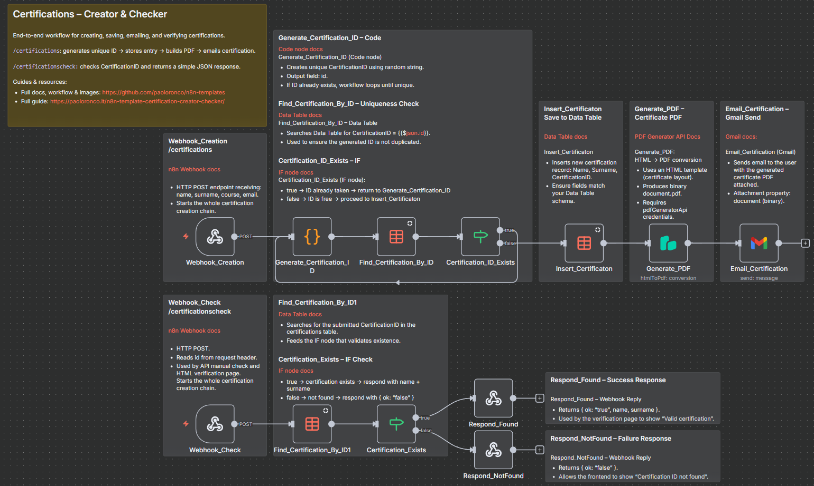

# Automated Digital Certificate Creator and Validator

## Quick Overview

Create personalized digital certificates through an n8n webhook, generate unique certificate IDs, store issued records, produce PDF certificates, email them to recipients, and expose a public endpoint for certificate verification.

## How It Works

- **Certificate request** — A POST webhook receives the candidate's name, surname, course, and email address.
- **Unique ID generation** — A Code node creates a Certification ID, while Data Table lookups check for collisions before continuing.
- **Certificate registry** — Valid certificate records are stored in an n8n Data Table with candidate name, surname, and Certification ID.
- **PDF generation** — PDF Generator API renders a personalized certificate using the HTML-based certificate definition and workflow data.
- **Email delivery** — Gmail sends the generated PDF certificate as an attachment to the recipient.
- **Certificate verification** — A separate webhook checks a Certification ID against the Data Table and returns its validity and holder name when found.
- **Verification page** — The included HTML page calls the verification webhook and displays the result in a browser interface.

## Setup

- **Import the workflow** — Import the included certificate workflow JSON into n8n.
- **Create the Data Table** — Create `Name`, `Surname`, and `CertificationID` fields, then select the table in the insert and lookup nodes.
- **Configure PDF Generator API** — Add credentials to the PDF generation node and review the included HTML certificate design.
- **Connect Gmail** — Configure Gmail OAuth2 credentials in the certificate email node.
- **Configure the verification page** — Replace the placeholder n8n domain in `Cerification_Check.html` with your public verification webhook URL.
- **Test both endpoints** — Issue a test certificate, confirm PDF/email delivery, and verify its generated ID before activation.

## Requirements

- n8n instance
- n8n Data Table with `Name`, `Surname`, and `CertificationID`
- PDF Generator API account and credentials
- Gmail OAuth2 credentials
- Publicly reachable n8n webhooks for external creation or verification

### Optional

- Web hosting for the included verification page
- Custom domain for public certificate verification
- Additional certificate metadata fields

## Customization

- **Certificate design** — Modify HTML layout, typography, colors, logos, images, text, and branding.
- **Certificate data** — Add fields to the creation webhook, Data Table, PDF, and verification response.
- **ID generation** — Replace the JavaScript ID algorithm with another identifier format.
- **Email content** — Customize Gmail subject, body, sender configuration, and attachment naming.
- **Verification UI** — Adapt the included page's branding, language, messages, layout, and endpoint.
- **Integrations** — Connect issuance or verification to an LMS, form, portal, CRM, or another workflow.

## Additional Info

- [Example certificate](./assets/Example-Certificate.pdf)
- [Project guide](https://paoloronco.it/n8n-template-certification-creator-checker/)
- [n8n Community Template](https://n8n.io/workflows/11097-automated-digital-certificate-creator-and-validator-with-pdf-generation/)
- Review authentication, abuse prevention, exposed personal data, and webhook security before production use.
