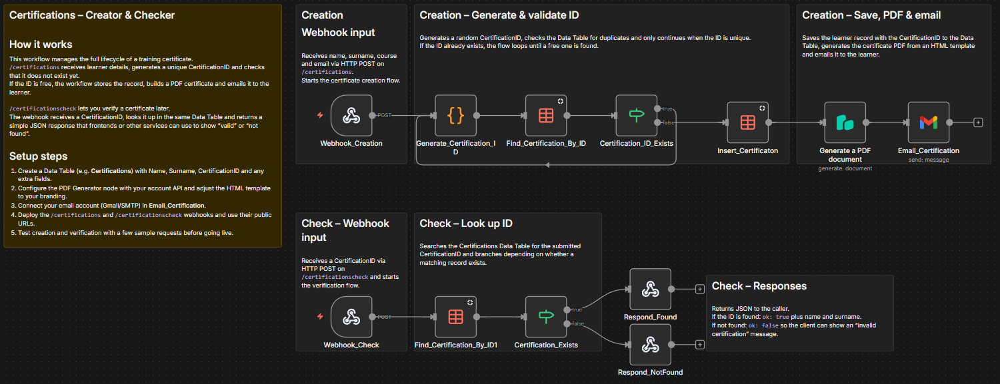

# Create and Validate Digital Certificates with PDF Generator API Templates

## Quick Overview

Issue and verify digital certificates with n8n using reusable PDF Generator API templates, unique certificate IDs, an n8n Data Table registry, Gmail delivery, and a public verification endpoint.

## How It Works

- **Certificate creation** — A POST webhook receives the candidate's name, surname, course, and email address.
- **Unique ID validation** — The workflow generates a Certification ID and checks the Data Table to prevent identifier collisions.
- **Registry storage** — Issued certificate records are persisted in an n8n Data Table for later lookup and verification.
- **Template-based PDF generation** — PDF Generator API receives JSON containing candidate, course, date, and ID values mapped to placeholders in a reusable visual template.
- **Email delivery** — Gmail sends the generated certificate PDF to the recipient supplied in the creation request.
- **Public verification** — The verification endpoint searches the registry by Certification ID and returns whether the certificate is valid and who it belongs to.

## Setup

- **Import the workflow** — Import the included workflow JSON into n8n.
- **Create the Data Table** — Add `Name`, `Surname`, and `CertificationID` fields and configure the insert and lookup nodes.
- **Import the PDF template** — Import the provided PDF Generator API template and verify its placeholders match the JSON keys sent by the workflow.
- **Configure PDF Generator API** — Add credentials and select the imported template in the PDF generation node.
- **Connect Gmail** — Configure Gmail OAuth2 credentials for certificate delivery.
- **Test and activate** — Create a sample certificate, confirm PDF mapping and email delivery, then test verification before activation.

## Requirements

- n8n instance
- n8n Data Table with `Name`, `Surname`, and `CertificationID`
- PDF Generator API account and credentials
- Imported PDF Generator API certificate template
- Gmail OAuth2 credentials
- Publicly reachable webhooks when exposed externally

### Optional

- Custom PDF Generator API template design
- QR code or additional visual elements
- Additional registry fields
- Frontend, LMS, or portal consuming the verification endpoint

## Customization

- **Template design** — Change layout, fonts, colors, logos, signatures, QR codes, and other visual elements without embedding HTML in n8n.
- **Template variables** — Extend the JSON payload and matching placeholders with additional certificate information.
- **Certificate ID** — Replace the default ID-generation logic with another identifier format.
- **Email delivery** — Customize Gmail subject, body, attachment name, and recipient logic.
- **Verification response** — Extend the API response with additional non-sensitive certificate metadata.
- **External integrations** — Connect certificate creation to forms, an LMS, CRM, e-commerce flow, or another application.

## Additional Info

- [Example certificate](./assets/Example-Certificate.pdf)
- [Full deployment guide](https://paoloronco.it/n8n-template-certification-creator-checker/)
- [n8n Community Template](https://n8n.io/workflows/11886-create-and-validate-digital-certificates-with-pdf-generator-api-and-gmail/)
- [PDF Generator API](https://pdfgeneratorapi.com/)
- [Video guide](https://youtu.be/eqSWoPndVUg)
- The reusable PDF template is included under `PDFgeneratorAPI-Template/`.
- Keep template placeholder names synchronized with the JSON keys sent by the workflow.
- Review webhook exposure, personal-data handling, authentication, and abuse prevention before production use.
