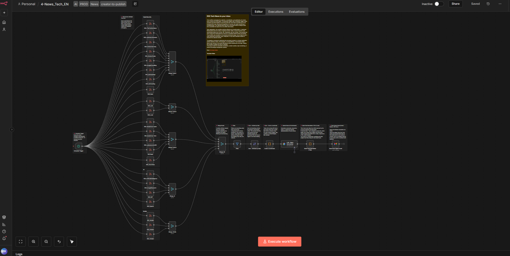

**Full Workflow Description – “Tech & AI Daily Briefing (RSS → AI → Email)”**

This workflow automates the entire lifecycle of collecting, filtering, summarizing, and delivering the most important daily news in **technology, artificial intelligence, cybersecurity, and the digital industry**.  
It functions as a **fully autonomous editorial engine**, combining dozens of RSS feeds, structured data processing, and an LLM (Google Gemini) to transform a large volume of raw articles into a concise, high–value daily briefing delivered straight to your inbox.

Read: [Full setup Guide](https://paoloronco.it/n8n-template-rss-tech-news-to-your-inbox/)



* * *

✅ **1. Scheduled Automation**
-----------------------------

The workflow begins with a **Schedule Trigger**, which runs at predefined intervals.  
Every execution generates a fresh briefing that reflects the most relevant news from the **past 24 hours**.

* * *

✅ **2. Massive Multi-Source RSS Collection**
--------------------------------------------

The workflow gathers content from over 25 curated RSS feeds covering:

### **🔐 Cybersecurity**

(The Hacker News, Krebs on Security, SANS, CVE feeds, Google Cloud Threat Intelligence, Cisco Talos, etc.)

### **🤖 Artificial Intelligence**

(Google Research, MIT News, AI News, OpenAI News)

### **💻 Technology & Digital Industry**

(Il Sole 24 Ore, Cybersecurity360, Graham Cluley, and more)

### **⚙️ Nvidia Ecosystem**

(Nvidia Newsroom, Nvidia Developer Blog, Nvidia Blog)

Each RSS feed is handled by a **dedicated node**, which ensures:

* source isolation

* easier debugging

* no single point of failure

The feeds are grouped using category-specific **Merge** nodes (Cyber1/2/3, AI, Nvidia), enabling modular scalability.

* * *

✅ **3. Unified Feed Aggregation**
---------------------------------

All category merges feed into the **Merge_All** node, creating a single combined dataset of articles from every source.

* * *

✅ **4. Intelligent Filtering (last 24 hours only)**
---------------------------------------------------

The **Filter** node removes:

* articles older than **24 hours** (based on `isoDate`)

* invalid items

* duplicated or redundant entries

This keeps the briefing strictly relevant to the current day.

* * *

✅ **5. Chronological Sorting**
------------------------------

The **Sort – Articles by Date** node orders all remaining items in descending date order.  
More recent or time-sensitive news is therefore prioritized.

* * *

✅ **6. Data Normalization (JavaScript Code)**
---------------------------------------------

A dedicated Code node transforms all incoming items into **one clean JSON object**:
    {
      "articles": [
        {
          "title": "...",
          "content": "...",
          "link": "...",
          "isoDate": "..."
        }
      ]
    }

This standardized structure becomes the input for the LLM summarization stage.

* * *

✅ **7. AI Editorial Processing – Google Gemini**
------------------------------------------------

The node **LLM – News Summarizer** is the workflow’s editorial brain.

A complex prompt instructs Gemini to behave like the **editor-in-chief of a major tech newspaper**, enforcing strict rules:

### Selection rules:

* choose only **8–10 truly important stories**

* ignore low-value content (minor product releases, clickbait, rumors…)

### Relevance criteria:

* AI research & foundation models

* Big Tech developments

* cybersecurity incidents

* regulation and digital policy

* semiconductors, cloud, and infrastructure

* digital rights, governance, sovereignty

### Deduplication:

If multiple feeds report the same story, only one version is kept.

### Output format:

Gemini must output **a valid JSON object** containing:

* `subject`: the email subject line

* `html`: a fully structured HTML body grouped into categories

Each news item ends with a **clickable HTML source link**, NEVER plaintext URLs.

This step condenses dozens of articles into a **polished, editorial-grade briefing**.

* * *

✅ **8. HTML Newsletter Assembly (Code Node)**
---------------------------------------------

The **Build Final Newsletter HTML** node:

* safely parses the JSON from the LLM

* cleans any ```json fences or extra text

* validates `subject` and `html` fields

* embeds the content into a **modern, responsive HTML email template**

The output is a single item containing:

* the final email subject

* the final HTML body  
  Ready to be sent.

* * *

✅ **9. Automatic Email Delivery**
---------------------------------

The **Send Final Digest Email** (Gmail node):

* uses the generated subject

* sends the curated HTML newsletter

* delivers it to the configured recipient(s)

* uses a custom sender name (“n8n News”)

The result is a fully automated **Tech & AI Daily Briefing** delivered with zero manual effort.

* * *

**In Summary: What This Workflow Achieves**
===========================================

✔ Collects news from **25+ high-quality RSS sources**  
✔ Normalizes, filters, and sorts all items automatically  
✔ Uses **Google Gemini** to select only the stories that truly matter  
✔ Generates a coherent, readable, professional-looking HTML newsletter  
✔ Sends the result via email every day

Perfect for:

* daily executive briefings

* technology and cybersecurity monitoring

* automated newsletter production

* internal knowledge distribution

* competitive intelligence workflows


