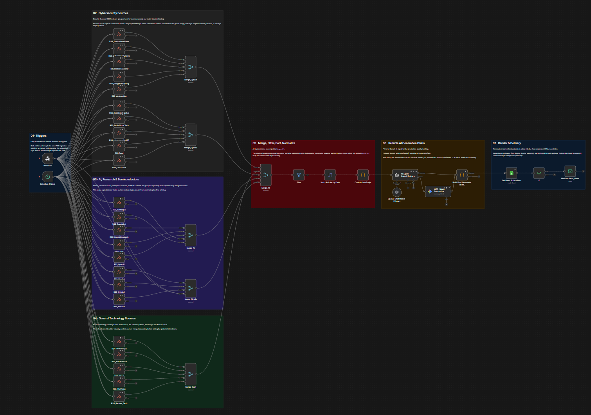

# 📰 Tech & AI Daily Briefing (RSS → AI → Email)

This workflow automates the entire lifecycle of collecting, filtering, deduplicating, summarizing, and delivering the most important daily news in **technology, artificial intelligence, cybersecurity, and the digital industry**.

It works as a **fully autonomous editorial engine**: it ingests ~25 RSS feeds, normalizes and deduplicates the articles, and uses a **resilient multi-model AI chain** (OpenAI as primary, Google Gemini as fallback, and a deterministic renderer as the final safety net) to turn a large volume of raw articles into a concise, high-value daily briefing — delivered to a list of subscribers via email.

📕 Full deploy guide: [paoloronco.it – Full deploy guide – Tech & AI Daily Briefing](https://paoloronco.it/n8n-template-rss-tech-news-to-your-inbox/)

👥 n8n Community Template: [Curate and Send Tech News Digests with RSS, Gemini AI and Gmail](https://n8n.io/workflows/11466-curate-and-send-tech-news-digests-with-rss-gemini-ai-and-gmail/)



---

## ⚙️ Setup

Before running the workflow, configure the following credentials and placeholders. The exported JSON is sanitized — no real keys, IDs, or recipients are included.

| Item | Where | What to set |
|---|---|---|
| **OpenAI API** | `OpenAI Chat Model - Primary` | Your OpenAI credential (primary model: `gpt-4.1-mini`) |
| **Google Gemini (PaLM) API** | `LLM - News Summarizer` | Your Gemini credential (fallback model: `gemini-2.5-flash`) |
| **Google Service Account** | `Get News Subscribers` | Service account with access to your subscribers Google Sheet |
| **`YOUR_GOOGLE_SHEET_ID`** | `Get News Subscribers` | ID of the Sheet holding a `Subscriber_email` column |
| **SMTP (e.g. Mailgun)** | `MailGun Send_News` | Your SMTP credential |
| **`news@example.com`** | `MailGun Send_News` → *From* | Your verified sender address |

> **Test tip:** before going live, temporarily point the send node to a single explicit recipient instead of the full subscriber list.

---

## ✅ 1. Triggers

The workflow can start in two ways, both feeding the same ingestion pipeline:

- **Schedule Trigger** — runs daily at **07:30**, generating a fresh briefing from the **last 24 hours**.
- **Webhook** (`/tech-news`) — manual entry point for on-demand testing without maintaining a separate test flow.

---

## ✅ 2. Massive Multi-Source RSS Collection

Content is gathered from ~25 curated RSS feeds, each handled by a **dedicated node** for source isolation, easier debugging, and no single point of failure. Every feed node uses `retryOnFail` and an error output, so a single broken provider never blocks the run.

Feeds are grouped by topic and consolidated through category-level **Merge** nodes:

### 🔐 Cybersecurity
The Hacker News, Cybersecurity News, Krebs on Security, Dark Reading, Cisco Talos, ESET, Google Cloud Threat Intelligence, Il Sole 24 Ore (Cyber), Cybersecurity360.

### 🤖 Artificial Intelligence & Research
Google Research, MIT, OpenAI, Anthropic, Google DeepMind.

### 💻 General Technology & Digital Industry
TechCrunch, Ars Technica, Wired, The Verge, Reuters Tech, Il Sole 24 Ore (Tech).

### ⚙️ NVIDIA Ecosystem
NVIDIA Newsroom, NVIDIA Developer Blog, NVIDIA Blog.

---

## ✅ 3. Unified Feed Aggregation

All category merges (`Merge_Cyber1`, `Merge_Cyber3`, `Merge_AI`, `Merge_Tech`, `Merge_Nvidia`) feed into a single **`Merge_All`** node, creating one combined dataset from every source.

---

## ✅ 4. Intelligent Filtering (last 24 hours)

The **Filter** node keeps only articles published in the **past 24 hours** (based on `isoDate`), discarding stale and invalid items so the briefing stays strictly current.

---

## ✅ 5. Chronological Sorting

The **Sort – Articles by Date** node orders the remaining items by `isoDate` in descending order, prioritizing the most recent and time-sensitive news.

---

## ✅ 6. Normalization, Deduplication & Source Capping (JavaScript Code)

A dedicated **Code** node transforms the raw items into a clean, balanced dataset:

- **Normalizes** each article into `{ title, content, link, isoDate, source }`.
- **Tags the human-readable source** from the article domain (e.g. `krebsonsecurity.com → Krebs on Security`).
- **Deduplicates** near-identical stories via title word-overlap similarity (>65%).
- **Caps each source to max 4 articles**, so no single outlet dominates the briefing.

The output is a single object with an `articles` array, ready for the AI stage.

---

## ✅ 7. Resilient AI Editorial Chain

This is the editorial brain of the workflow, designed so that **provider rate limits or malformed output never block delivery**:

1. **Primary — OpenAI AI Agent.** A deterministic senior-editor prompt selects 7–10 truly relevant stories, enforces topic diversity and per-category caps, deduplicates, and outputs **structured JSON only** (categories → articles with `title`, `summary`, `source_name`, `link`).
2. **Fallback — Google Gemini.** On primary failure, Gemini runs the same prompt with retry/backoff (3 tries, 60s wait).
3. **Final safety net — Deterministic renderer.** If both models fail, the HTML builder classifies and summarizes the pre-processed articles itself, so a briefing is always produced.

The LLMs produce **data only** — all HTML rendering is owned by the next node. Strict anti-hallucination rules require links and sources to be copied verbatim from the input.

---

## ✅ 8. HTML Newsletter Assembly (Code Node)

The **Build Final Newsletter HTML** node:

- Robustly extracts and parses the JSON from any model output format (strips ```json fences, repairs trailing commas).
- Falls back to the deterministic renderer when data is missing or invalid.
- Escapes content and renders only valid `https?://` source links.
- Embeds everything into a **modern, responsive HTML email template** grouped by category.

Output: a single item with the final `subject` and `html`.

---

## ✅ 9. Subscriber Delivery

- **Get News Subscribers** (Google Sheets) loads the recipient list.
- The **IF** node validates each address (non-empty and contains `@`).
- **MailGun Send_News** (SMTP) sends the curated HTML newsletter to each valid subscriber from the configured sender address.

The result is a fully automated **Tech & AI Daily Briefing** delivered with zero manual effort.

---

## In Summary: What This Workflow Achieves

✔ Collects news from **~25 high-quality RSS sources**
✔ Normalizes, filters, sorts, deduplicates, and caps sources automatically
✔ Uses a **resilient OpenAI → Gemini → deterministic** chain to select only what matters
✔ Generates a coherent, readable, professional HTML newsletter
✔ Delivers it to a **subscriber list** via SMTP every day

**Perfect for:**

- daily executive briefings
- technology and cybersecurity monitoring
- automated newsletter production
- internal knowledge distribution
- competitive intelligence workflows
