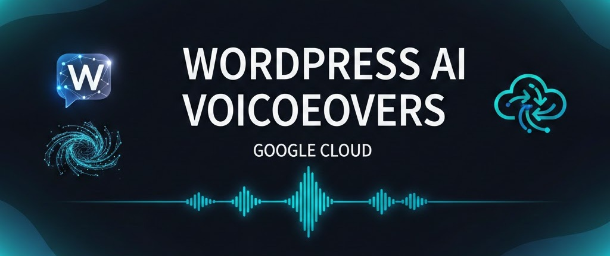

# 🎧 WordPress AI VoiceOver Automation

### Convert WordPress Articles into Multilingual Audio — Fully Automated with n8n, OpenAI & Google Cloud

This repository showcases the complete automation workflow that transforms your WordPress posts into **professional, multilingual voiceovers**—entirely hands-free.

The workflow is publicly available for purchase here:

👉 **Gumroad:** [https://paoloronco.gumroad.com/l/ailfum](https://paoloronco.gumroad.com/l/ailfum)

👉 **paoloronco.it Store:** [https://shop.paoloronco.it/21-n8n-workflow-wordpress-ai-voiceovers-with-google-cloud.html](https://shop.paoloronco.it/21-n8n-workflow-wordpress-ai-voiceovers-with-google-cloud.html)

👉 **n8n Marketplace:** *Publishing soon*

---

## 🎧 Example generated voiceovers

### Example voiceover: My Github Pages Website
<audio controls>
  <source src="https://storage.googleapis.com/wp-voiceovers/631EN.wav" type="audio/wav">
  Your browser does not support the audio element.
</audio>

### Example voiceover: n8n Template - fetch AmazonLuna Games
<audio controls>
  <source src="https://storage.googleapis.com/wp-voiceovers/1767EN.wav" type="audio/wav">
  Your browser does not support the audio element.
</audio>

### Example voiceover: Github paoloronco/lynx
<audio controls>
  <source src="https://storage.googleapis.com/wp-voiceovers/1685EN.wav" type="audio/wav">
  Your browser does not support the audio element.
</audio>

---

## 🚀 What This Automation Does

This advanced n8n workflow automatically:

* **Fetches your WordPress posts**
* **Cleans and normalizes text** using OpenAI for flawless TTS input
* **Translates content** (IT ↔ EN by default — expandable to any language)
* **Generates high-quality audio** using Google Cloud Long-Form Text-to-Speech
* **Publishes audio players directly on your WordPress site**
* **Logs every processed post** inside Google Sheets for full traceability
* **Runs on autopilot**, processing posts on schedule

Perfect for creators, publishers, agencies, educators, and anyone wanting to offer **accessible audio content** without manual work.

---

## ✨ Key Features

### 🔊 High-Quality Voiceovers

Uses Google Cloud’s **Long Audio TTS**, delivering natural, human-like audio for long-form content.

### 🌍 Multilingual by Design

Ships with Italian → English voiceover generation, but fully customizable for any language combination.

### 🧹 Smart AI Text Cleaning

OpenAI removes noise, formatting, special characters, and unnecessary markup for optimal TTS output.

### 📝 Google Sheets Tracking

Every article is stored, cleaned, processed, and logged with real-time status.

### 🔄 Automated WordPress Publishing

Audio players are inserted directly into your dedicated VoiceOver page.

### 🧩 Modular & Extensible

Add languages, change voices, integrate notifications, or expand the workflow as your project grows.

---

## 📦 What You Get

When purchasing the workflow:

* ✔ Complete **n8n automation JSON**
* ✔ **Google Cloud TTS microservice** (FastAPI + Docker)
* ✔ Full **setup documentation** (WordPress + Google Cloud + n8n)
* ✔ Google Sheets template
* ✔ Troubleshooting and optimization guides
* ✔ Free lifetime documentation updates

---

## 🛠️ Why This Workflow Exists

Manually creating audio content is slow, repetitive, and expensive.
This automation solves that by providing:

* A **reliable**, production-ready process
* A **scalable** foundation for multilingual audio content
* A **no-code/low-code** solution built entirely on robust APIs
* A clean, modular architecture anyone can extend

If you publish content on WordPress, this automation instantly transforms your articles into an audio library your users will love.

---

## ⭐ Want a Feature Demo or Custom Workflow?

Feel free to open an issue or contact me directly.
Custom integrations, multilingual setups, and enterprise deployments are available on request.

---

