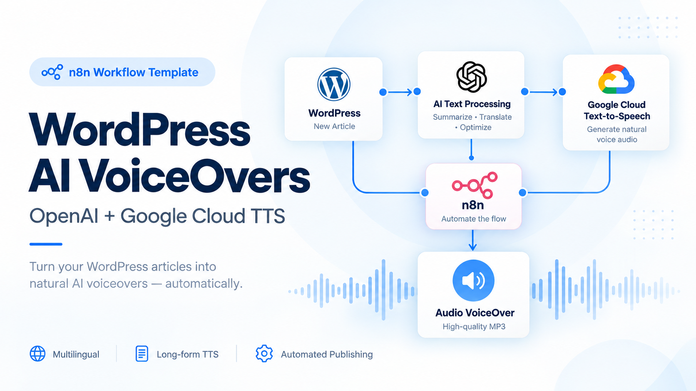

# WordPress AI VoiceOvers — OpenAI + Google Cloud TTS

## Quick Overview

Automatically transform WordPress articles into multilingual audio. The solution cleans and translates article content with OpenAI, generates long-form speech through Google Cloud Text-to-Speech, publishes audio back to WordPress, and tracks processing in Google Sheets.

## How It Works

- **WordPress ingestion** — The workflow retrieves WordPress articles selected for voiceover processing.
- **AI text preparation** — OpenAI cleans and normalizes article content so markup and formatting do not degrade speech generation.
- **Translation** — Content can be translated between configured languages before speech synthesis.
- **Long-form TTS** — Google Cloud generates audio suitable for longer WordPress content through the included TTS architecture.
- **Publishing** — Generated audio is associated with the WordPress content so visitors can listen to the article.
- **Tracking** — Google Sheets records processing state and provides traceability across articles and generated voiceovers.

## Setup

- **Purchase the complete package** — Obtain the workflow, TTS microservice, configuration files, and deployment documentation from Gumroad or the store.
- **Configure WordPress** — Connect the target WordPress site and review the content-selection and publishing configuration.
- **Configure OpenAI** — Add the required credentials and review cleaning, translation, and language settings.
- **Deploy Google Cloud TTS** — Follow the included documentation to configure Google Cloud and the supplied FastAPI/Docker TTS component.
- **Connect Google Sheets** — Configure the tracking spreadsheet and credentials used by the workflow.
- **Test the pipeline** — Process a sample article end-to-end before enabling scheduled production runs.

## Requirements

- n8n instance
- WordPress site with suitable API access
- OpenAI API credentials
- Google Cloud project with Text-to-Speech services configured
- Google Sheets and credentials
- Environment capable of running the supplied TTS service

### Optional

- Additional languages and voices
- Custom WordPress audio-player presentation
- Additional status notifications or monitoring
- Alternative scheduling and article-selection rules

## Customization

- **Languages** — Extend the default language flow with additional translation and TTS combinations.
- **Voices** — Change Google Cloud voices, language codes, and speech configuration.
- **AI processing** — Adapt the OpenAI prompts used for cleaning and translation.
- **Publishing** — Customize where and how generated audio is presented in WordPress.
- **Tracking** — Extend Google Sheets with additional metadata, status fields, or reporting.
- **Workflow extensions** — Add notifications, approval steps, storage targets, or downstream publishing channels.

## Additional Info

- [n8n Community Template](https://n8n.io/workflows/11789-convert-wordpress-articles-to-multilingual-voiceovers-with-google-tts-and-openai/)
- [Gumroad](https://paoloronco.gumroad.com/l/ailfum)
- [Paolo Ronco Store](https://shop.paoloronco.it/21-n8n-workflow-wordpress-ai-voiceovers-with-google-cloud.html)
- The complete paid package includes the n8n workflow, Google Cloud TTS microservice, setup documentation, Google Sheets template, and troubleshooting material.
- This public repository intentionally contains the product overview and media samples rather than the complete paid workflow package.

## Media Samples

The repository includes generated audio examples under `assets/`:

- `GitHubPagesWebsite.mp3`
- `n8n-template-fetch-amazonlunagames.mp3`
- `Github-paoloronco-Lynx.mp3`

These samples demonstrate output generated by the voiceover pipeline.
