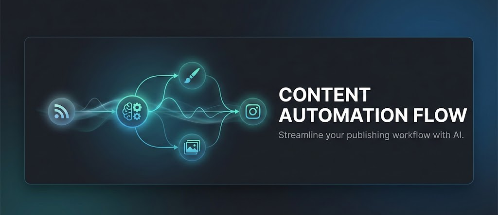

# AI News → Social Publishing Automation

An advanced automation that collects the latest news from **any topic or industry** via RSS feeds, analyzes them with AI, and automatically creates **ready-to-post Instagram content** — complete with title, caption, and AI-generated image.

Ideal for creators, media professionals, and brands that want to keep their social channels **active, consistent, and always on-trend** — without manual research or content drafting.

👉 **Gumroad:** [n8n Workflow: “AI News → Social Publishing Automation”](https://paoloronco.gumroad.com/l/AInews-SocialPubblishing)

👉 **paoloronco.it Store:** [n8n Workflow: “AI News → Social Publishing Automation”](https://shop.paoloronco.it/20-n8n-workflow-ai-news-social-publishing-automation.html)

👉 **n8n Marketplace** [Automate RSS to Instagram with AI-Generated Content and Cloudinary](https://n8n.io/workflows/11791-automate-rss-to-instagram-with-ai-generated-content-and-cloudinary/)

### **What it does**

* Reads and aggregates news from one or more RSS feeds (customizable by category).
* Uses AI to select the most relevant or engaging articles.
* Generates a caption and headline with a natural, professional tone.
* Creates a realistic AI-generated image to match the topic.
* Uploads the image to Cloudinary and publishes the post directly to Instagram through the Meta Graph API.
* Runs automatically on schedule (default: every 5 hours) — no manual steps required.

### **Why it’s different**

* Works with any subject or niche, from tech to fashion, news, travel, and more.
* Includes a guide with curated RSS feed sources by category — ready to plug in.
* AI-driven content generation for text and visuals, tuned for professional results.
* Fully automated workflow — from discovery to publishing.
* Self-hosted and scalable, with no vendor lock-in.

### **What’s included**

* Workflow JSON file (import-ready for n8n).
* PDF deployment guide (written together), covering:
* how to set up RSS sources by category;
* configuring APIs (OpenAI, Cloudinary, Meta Graph);
* scheduling and testing the workflow;
* recommended best practices for stability and scaling.
