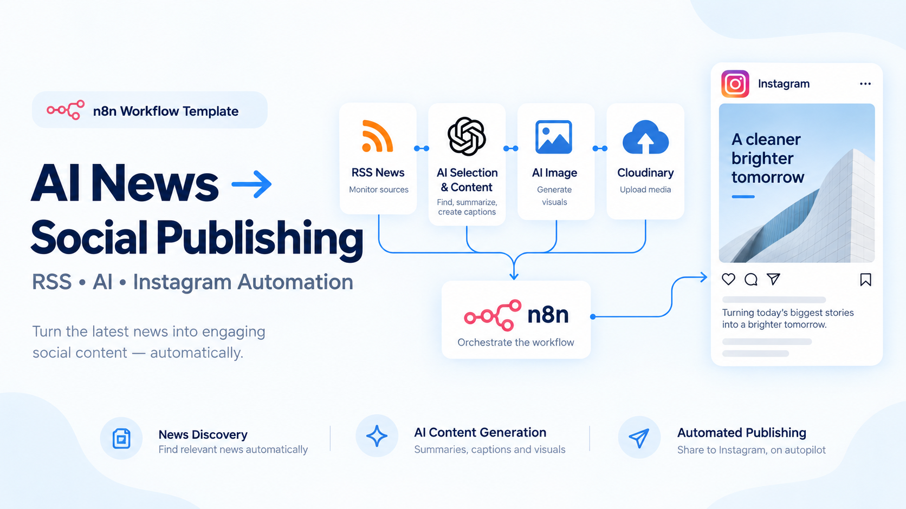

# AI News → Social Publishing Automation

## Quick Overview

Turn RSS news into publishable Instagram content automatically. The workflow collects articles, uses AI to select and transform relevant stories, generates captions and visuals, uploads media through Cloudinary, and publishes to Instagram through the Meta Graph API.

## How It Works

- **RSS collection** — The workflow reads one or more configurable RSS feeds for the topics or industries you want to monitor.
- **AI selection** — AI evaluates incoming stories and selects content suitable for social publishing.
- **Copy generation** — The selected article is transformed into a social headline and Instagram-ready caption.
- **Image generation** — AI creates a visual associated with the selected story and publishing context.
- **Media hosting** — Cloudinary stores the generated image and provides the media URL required by the publishing flow.
- **Instagram publishing** — The Meta Graph API publishes the generated image and caption to the configured Instagram account.
- **Scheduling** — The complete pipeline can run automatically on a configurable schedule.

## Setup

- **Purchase the complete package** — Obtain the importable workflow and full deployment documentation from Gumroad or the store.
- **Configure RSS feeds** — Replace or extend the source feeds for your target niche, publication set, or topic.
- **Configure AI services** — Add the required AI credentials and review prompts for selection, copy, and image generation.
- **Configure Cloudinary** — Connect the account used to host generated social images.
- **Configure Meta** — Connect the required Instagram/Meta Graph API credentials and target professional account.
- **Review the schedule** — Set a publishing frequency appropriate for your content strategy.
- **Test before publishing** — Run the workflow with controlled inputs and verify copy, image, upload, and Instagram publishing.

## Requirements

- n8n instance
- One or more RSS feeds
- AI provider/API credentials required by the purchased workflow
- Cloudinary account
- Meta/Instagram professional account with Graph API access
- Required Meta application permissions and credentials

### Optional

- Additional RSS categories or source lists
- Alternative AI models or providers
- Additional moderation or approval step before publishing
- Additional social publishing destinations

## Customization

- **Topics and sources** — Replace the RSS feeds to target technology, fashion, travel, business, or another niche.
- **Editorial behavior** — Modify AI prompts for article selection, tone, headline style, and caption structure.
- **Visual generation** — Adapt image prompts and generation settings to your brand or content style.
- **Publishing frequency** — Change the schedule or add approval gates before publication.
- **Distribution** — Extend the workflow beyond Instagram with additional social channels.
- **Branding** — Add recurring brand instructions, hashtags, CTA rules, or visual constraints.

## Additional Info

- [n8n Community Template](https://n8n.io/workflows/11791-automate-rss-to-instagram-with-ai-generated-content-and-cloudinary/)
- [Gumroad](https://paoloronco.gumroad.com/l/AInews-SocialPubblishing)
- [Paolo Ronco Store](https://shop.paoloronco.it/20-n8n-workflow-ai-news-social-publishing-automation.html)
- The purchased package includes the importable workflow and complete setup documentation covering RSS sources, APIs, scheduling, testing, and operational guidance.
- This public repository contains the product overview and promotional assets; the complete paid workflow is delivered with the purchased package.
