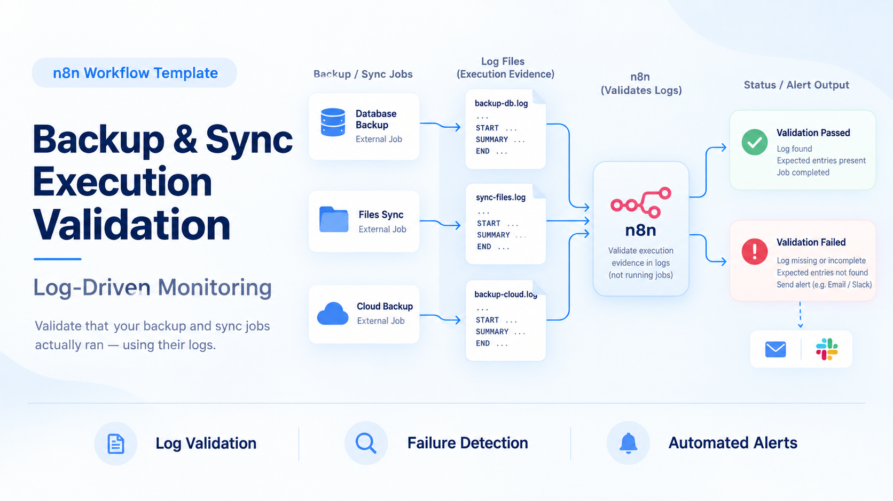

# Reliable Backup & Sync Execution Validation — Log-Driven Monitoring

## Quick Overview

Monitor backup and synchronization jobs by validating structured execution logs rather than remotely executing the jobs. The workflow checks expected daily evidence, identifies missing or failed runs, and can route operational alerts through configured notification and ticketing services.

## How It Works

- **External job execution** — rsync, rclone, or compatible jobs run independently from n8n and produce structured logs using the expected lifecycle contract.
- **Log collection** — Execution logs are uploaded to the configured Google Cloud Storage location for centralized validation.
- **Expected-job validation** — The workflow compares expected jobs against available logs for the relevant execution period.
- **Lifecycle validation** — Log contents can be inspected for required events such as `START`, transfer completion, `SUMMARY`, and `END`.
- **Failure classification** — Missing, incomplete, warning, or non-zero execution evidence is classified for downstream handling.
- **Alerting and ticketing** — Detected problems can be routed through Gmail and GLPI, with additional workflow logic available for analysis and notification.

## Setup

- **Purchase the complete package** — Obtain the n8n workflow, reference shell scripts, and complete deployment documentation.
- **Define monitored jobs** — Configure the expected backup/sync jobs and their log filenames according to the supplied documentation.
- **Deploy the logging contract** — Adapt the included rsync/rclone shell templates or make existing jobs emit compatible lifecycle events.
- **Configure log storage** — Connect the Google Cloud Storage location used to collect execution logs.
- **Configure integrations** — Add the Google Cloud, Gmail, GLPI, GitHub, and AI credentials required by the purchased workflow configuration.
- **Test failure scenarios** — Validate successful, missing, incomplete, warning, and non-zero-return-code cases before relying on production alerts.

## Requirements

- n8n instance
- Backup or synchronization jobs capable of producing compatible structured logs
- Google Cloud Storage bucket and credentials
- Configuration describing the expected jobs/log filenames
- Credentials for the notification or ticketing integrations enabled in the workflow

### Optional

- Included rsync job template
- Included rclone job template
- Gmail notifications
- GLPI ticket creation
- GitHub integration
- AI-assisted analysis where configured

## Customization

- **Job inventory** — Add or remove expected jobs and their corresponding log names.
- **Log producers** — Adapt the supplied shell templates for your existing rsync, rclone, backup, or synchronization processes.
- **Validation rules** — Change lifecycle markers, warning handling, return-code interpretation, or freshness requirements.
- **Alert routing** — Customize which conditions generate email, ticket, or other notification actions.
- **Storage** — Adapt the ingestion logic if execution logs are stored somewhere other than Google Cloud Storage.
- **Operational metadata** — Extend alerts with host, environment, job category, owner, or remediation information.

## Additional Info

- [n8n Community Template](https://n8n.io/workflows/12880-monitor-backup-and-sync-logs-with-google-cloud-storage-github-gmail-openai-and-glpi/)
- [Gumroad](https://paoloronco.gumroad.com/l/ReliableBackup-SyncExecutionValidation)
- [Paolo Ronco Store](https://shop.paoloronco.it/23-backup-sync-execution-validation-log-driven.html)
- Reference scripts are preserved under `job-templates/`: `rsync_job-Template.sh` and `rclone_job-Template.sh`.
- The monitoring design is intentionally decoupled from job execution: n8n validates evidence produced by external jobs rather than connecting to servers to run them.
- The complete purchased package includes the workflow and detailed deployment/configuration documentation.
