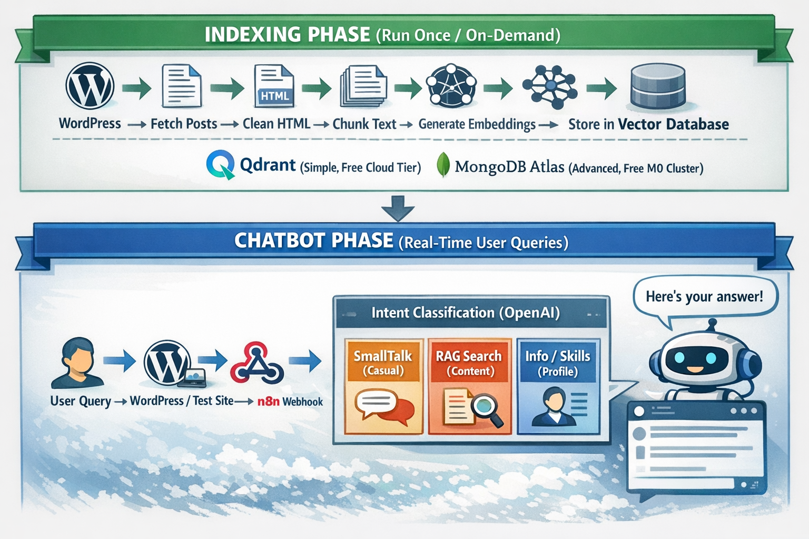
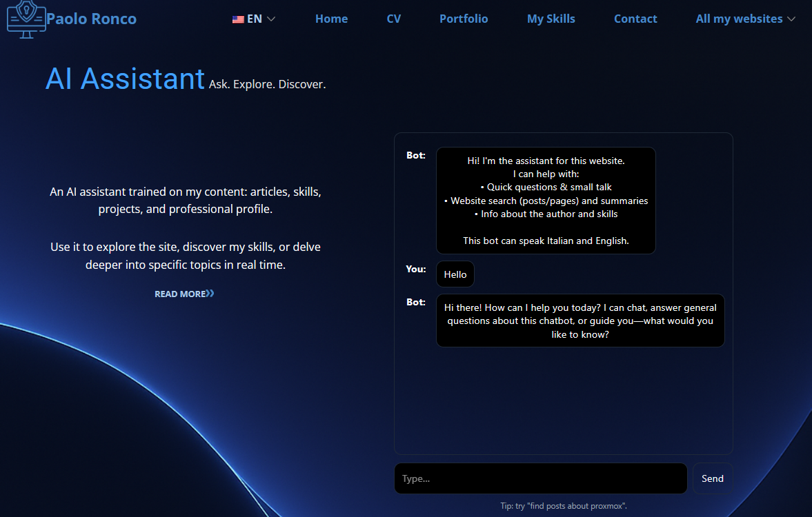
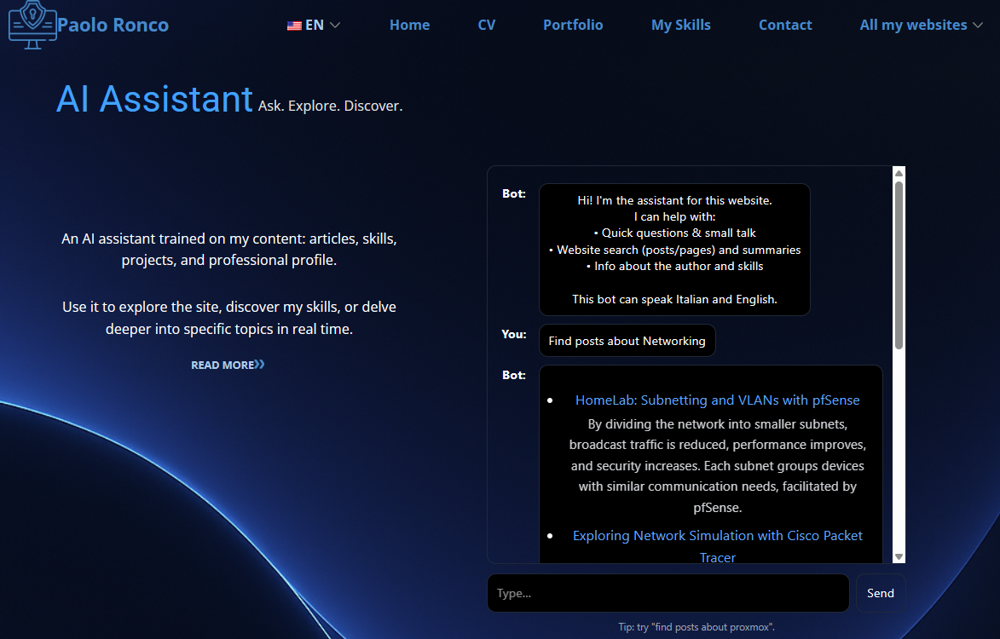
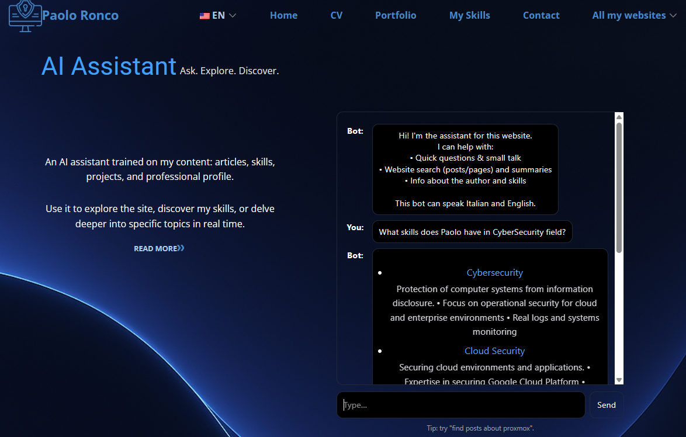

# WordPress AI Chatbot with n8n

A production-ready AI chatbot for WordPress sites using n8n workflows, vector databases, and OpenAI. Provides semantic search across your content with RAG (Retrieval-Augmented Generation).

<p align="center">
  
</p>

---

## Purchase

<p align="center">
  <a href="https://paoloronco.gumroad.com/l/wordpress-aichatbot" target="_blank">
    
  </a>
  <a href="https://n8n.io/workflows/13291-build-a-wordpress-rag-chatbot-with-openai-qdrant-or-mongodb/" target="_blank">
    
  </a>
  <a href="https://shop.paoloronco.it" target="_blank">
    
  </a>
</p>

---

## Table of Contents

- [Overview](#overview)
- [Screenshots](#screenshots)
- [Features](#features)
- [Architecture](#architecture)
- [Use Cases](#use-cases)
- [What's Included](#whats-included)
- [Technical Details](#technical-details)
- [Pricing & Purchase](#pricing--purchase)
- [Setup Overview](#setup-overview)
- [Cost Estimate](#cost-estimate)
- [FAQ](#faq)
- [System Requirements](#system-requirements)
- [Comparison](#comparison)
- [Contact](#contact)
- [License](#license)

---

## Overview

This is a complete AI chatbot solution for WordPress websites, powered by n8n automation workflows. It uses semantic search to understand user questions and provides accurate answers based on your actual WordPress content.

**Key capabilities:**
- No coding required - import workflows and configure
- Semantic search using vector embeddings
- Choice of vector databases (Qdrant or MongoDB Atlas)
- Built-in authentication and GDPR-compliant logging
- Multilingual support (English and Italian, extensible)
- Works with free tiers of all required services

---

## Screenshots

<p align="center">
  
  
  
</p>
<p align="center">
  <em>Small Talk • Content Search • Skills/Profile Queries</em>
</p>

---

## Features

### Intent Classification
The chatbot routes queries intelligently:
- **Small Talk** - Casual conversations, greetings
- **Content Search** - Semantic search across WordPress posts
- **Profile/Skills** - Optional database for expertise/experience queries

### Semantic Search
- Vector embeddings for meaning-based search (not just keywords)
- Reranking with Cohere for improved relevance
- Combines multiple sources for comprehensive answers
- Intelligent document chunking

### Security
- Bearer token authentication for webhooks
- GDPR-compliant IP hashing (SHA3-256)
- Input sanitization
- Server-side API key management
- HTTPS-only communication

### User Experience
- Modern, responsive chat interface
- Simple WordPress shortcode integration: `[wp_ai_chatbot]`
- Customizable colors and styling
- Mobile-optimized

### Vector Database Options

| Feature | Qdrant | MongoDB Atlas |
|---------|--------|---------------|
| Setup Time | 15 minutes | 1-2 hours |
| Best For | WordPress content only | Multiple data sources |
| Free Tier | 1GB storage | 512MB M0 cluster |
| Use Cases | Blogs, documentation | Portfolios, complex projects |

---

## Architecture

```
INDEXING PHASE (Run once or on-demand)
┌──────────────────────────────────────────────────────────────────┐
│  WordPress Posts → Clean & Chunk → Generate Embeddings →        │
│  → Store in Vector Database (Qdrant or MongoDB)                 │
└──────────────────────────────────────────────────────────────────┘

CHATBOT PHASE (Real-time queries)
┌──────────────────────────────────────────────────────────────────┐
│  User Query → Intent Classification (AI) →                      │
│                                                                  │
│  ┌────────────────────────────────────────────────────┐         │
│  │  SmallTalk  │  RAG Search  │  Profile/Skills       │         │
│  │  (Direct)   │  (Semantic)  │  (MongoDB)            │         │
│  └────────────────────────────────────────────────────┘         │
│                         ↓                                        │
│              AI Response Generation (GPT-4)                      │
│                         ↓                                        │
│              WordPress Plugin Display                            │
└──────────────────────────────────────────────────────────────────┘
```

---

## Use Cases

**Content Sites & Blogs**
- Answer questions about your articles
- Help visitors discover related content
- Reduce bounce rate

**Business Websites**
- Automate common support questions
- Provide 24/7 assistance
- Reduce support ticket volume

**Portfolio Sites**
- Discuss your skills and experience (requires MongoDB path)
- Answer questions about projects
- Engage potential clients

**Documentation Sites**
- Semantic search across technical docs
- Find solutions by meaning, not just keywords
- Combine multiple doc sources

**E-commerce**
- Answer product questions
- Search product descriptions and specs
- Guide customers

---

## What's Included

When you purchase this solution:

### Core Components
- **2 n8n Workflow Files** (JSON format)
  - Indexing Workflow (WordPress → Vector Database)
  - Chatbot Workflow (User Queries → AI Responses)
- **WordPress Plugin** (PHP, JavaScript, CSS)
  - Secure REST API proxy
  - Chat interface
  - Admin settings panel
  - Customizable shortcode
- **Test Micro-Website** - Standalone HTML for testing workflows

### Documentation
- Setup guides with step-by-step instructions
- Two setup paths: Quick (Qdrant, 15-25 min) or Advanced (MongoDB, 1-2 hours)
- Customization guide for AI behavior and UI
- Troubleshooting guide
- Security best practices

### Bonus Tools
- MongoDB embedding scripts (Node.js)
- Sample data files
- Vector search test scripts

### Support
- Email support for installation
- Full documentation access
- 12 months of updates
- Community access

---

## Technical Details

**AI & ML:**
- OpenAI GPT-4/4.5 for responses
- Text embeddings (1536-dimensional vectors)
- Cohere reranker (optional)
- Intent classification

**Backend:**
- n8n workflows (visual automation)
- Qdrant Cloud or MongoDB Atlas (vector databases)
- RESTful APIs
- Webhook system

**Frontend:**
- WordPress plugin (PHP 7.4+)
- Vanilla JavaScript
- Responsive CSS
- REST API client

**Security:**
- GDPR compliant (IP hashing)
- Bearer token authentication
- WordPress nonces (CSRF protection)
- Input validation and sanitization
- HTTPS encryption

---

## Pricing & Purchase

**Where to Buy:**
- [Buy on Gumroad](#) - Digital download, instant delivery
- [Buy on n8n Creators Hub](#) - Official n8n marketplace
- [Buy on Our Store](#) - PrestaShop with support options

**What You Get:**
- All workflow files and WordPress plugin
- Complete documentation
- Lifetime access to purchased version
- 12 months of free updates
- Email support for installation
- Commercial use license

**Optional Add-ons:**
- Premium support package
- Custom branding service
- Professional setup assistance

---

## Setup Overview

After purchase:

1. **Choose Your Path** (5 minutes)
   - Beginner: Quick setup with Qdrant (15-25 min total)
   - Advanced: Full setup with MongoDB (1-2 hours total)

2. **Setup Services** (10-20 minutes)
   - Create accounts (OpenAI, Qdrant/MongoDB)
   - Get API keys (documented)
   - Access n8n instance

3. **Import Workflows** (5 minutes)
   - Import 2 JSON files into n8n
   - Configure credentials
   - Activate workflows

4. **Index Content** (2-10 minutes)
   - Run indexing workflow once
   - WordPress content becomes searchable

5. **Deploy Frontend** (10 minutes)
   - Upload WordPress plugin
   - Configure webhook URL
   - Add shortcode to pages

**Total Setup Time:** 30 minutes to 2 hours (depending on path)

---

## Cost Estimate

For a typical small site (100 posts, 500 queries/month):

| Service | Cost | Notes |
|---------|------|-------|
| OpenAI Embeddings | ~$0.10 | One-time (indexing) |
| OpenAI Chat | $5-10/month | Based on usage |
| Qdrant Cloud | $0 | Free tier |
| MongoDB Atlas | $0 | Free M0 cluster |
| Cohere Reranking | $0 | Free tier (optional) |
| n8n Self-Hosted | $0 | If self-hosted |
| n8n Cloud | $20/month | If using cloud |
| n8n VPS | $0-10/month | If using VPS/Cloud VM |
| **TOTAL** | **$5-30/month** | Depends on n8n choice |

All required services have free tiers suitable for small to medium sites.

---

## FAQ

**Q: Do I need coding skills?**
A: No. If you can follow instructions and copy/paste, you can set this up.

**Q: What if I get stuck?**
A: Email support is included, plus comprehensive troubleshooting documentation.

**Q: Can I customize the appearance?**
A: Yes. Full access to CSS and UI code for customization.

**Q: Will this work with my WordPress theme?**
A: Yes. Works with any theme using shortcode integration.

**Q: How much does it cost to run monthly?**
A: $5-10/month for typical small sites (mostly OpenAI API costs).

**Q: Can I use this for multiple sites?**
A: License allows use on sites you own or manage. Agency licensing available separately.

**Q: Is it GDPR compliant?**
A: Yes. IP addresses are hashed (SHA3-256) before logging.

**Q: What WordPress version is required?**
A: WordPress 5.0+ with REST API enabled (default on modern installations).

**Q: Can I switch from Qdrant to MongoDB later?**
A: Yes. The architecture supports both.

---

## System Requirements

**Required:**
- WordPress 5.0+ with REST API enabled
- n8n instance (self-hosted or cloud)
- OpenAI API key
- Vector database (Qdrant Cloud or MongoDB Atlas)

**Recommended:**
- HTTPS on WordPress site
- PHP 7.4+ on WordPress
- Cohere API key for reranking (optional)

**Free Tier Compatibility:**
- Qdrant Cloud: 1GB storage
- MongoDB Atlas: 512MB M0 cluster
- OpenAI: $5 free credit
- Cohere: 100 requests/minute

---

## Comparison

| Feature | This Solution | Typical SaaS Alternatives |
|---------|--------------|---------------------------|
| Setup Time | 15 minutes - 2 hours | Varies |
| Coding Required | None (import workflows) | None to extensive |
| Monthly Cost | $5-10 (API only) | $50-500+ (subscriptions) |
| Customization | Full control | Limited to platform features |
| Data Ownership | You own everything | Stored on 3rd party servers |
| Privacy | GDPR compliant, self-hosted | Varies |
| Scalability | Grows with your needs | Pay more for scaling |

---

## Purchase

<p align="center">
  <a href="https://paoloronco.gumroad.com/l/wordpress-aichatbot" target="_blank">
    
  </a>
  <a href="https://n8n.io/workflows/13291-build-a-wordpress-rag-chatbot-with-openai-qdrant-or-mongodb/" target="_blank">
    
  </a>
  <a href="https://shop.paoloronco.it" target="_blank">
    
  </a>
</p>


---

## Contact

- **Website:**  https://paoloronco.it/
- **Email:** info@paoloronco.it

## License

- Lifetime access to purchased version
- Cannot resell or redistribute
- See LICENSE.md for full terms

---

## Acknowledgments

Built with n8n, OpenAI, Qdrant/MongoDB, and WordPress.

© 2026 Paolo Ronco. All rights reserved.
