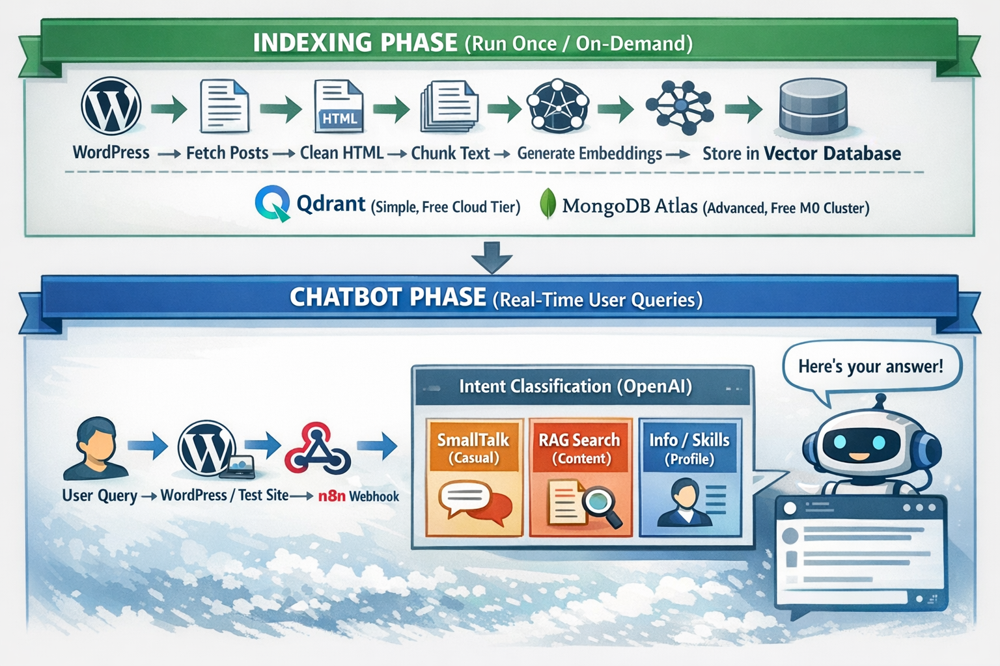
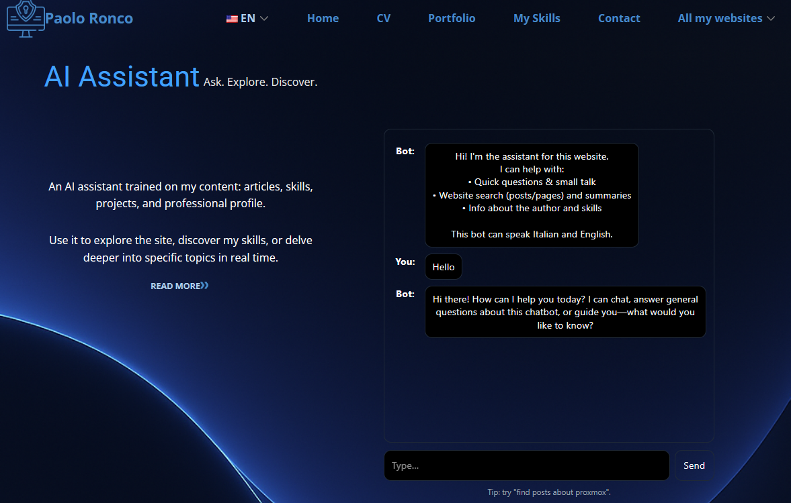
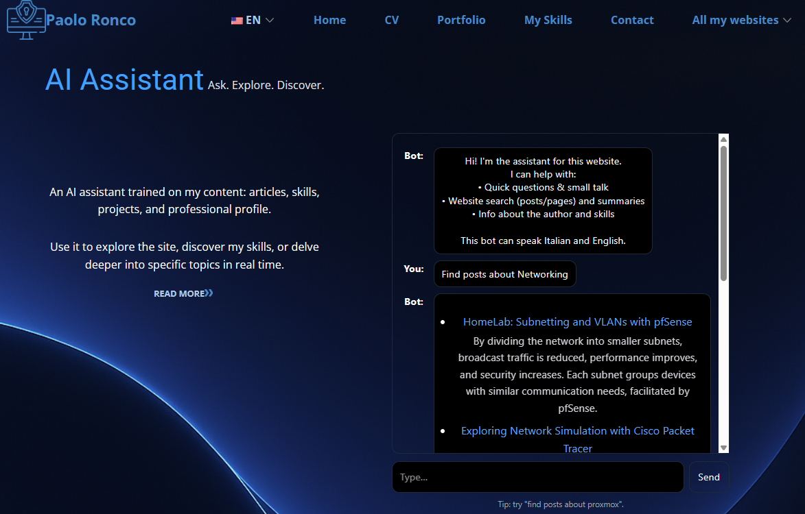
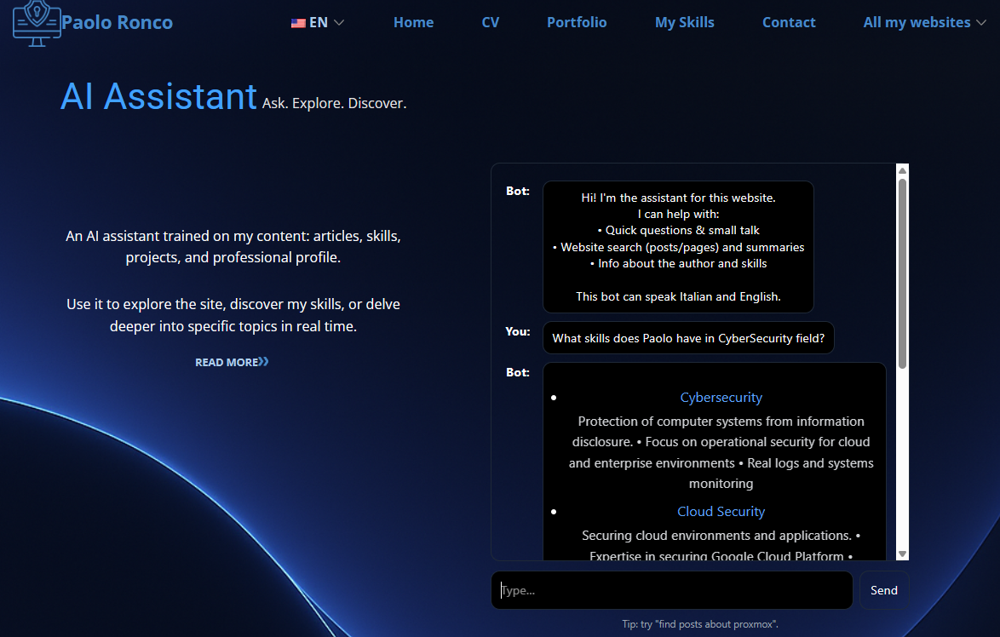

# WordPress AI Chatbot — RAG with n8n

  

## Quick Overview

Build a WordPress chatbot that answers questions from your site content using Retrieval-Augmented Generation. n8n handles indexing and chat orchestration, while Qdrant or MongoDB Atlas provides vector search and OpenAI generates context-grounded responses.

## How It Works

- **Content indexing** — WordPress content is retrieved, cleaned, chunked, embedded, and stored in the selected vector database.
- **Intent routing** — Incoming questions are classified so conversational requests, content searches, and optional profile/skills queries can follow different paths.
- **Semantic retrieval** — Relevant chunks are retrieved by meaning rather than exact keyword matching.
- **Reranking** — Cohere can rerank retrieved documents before response generation to improve relevance.
- **Response generation** — OpenAI generates an answer using the retrieved context and configured assistant behavior.
- **WordPress delivery** — The supplied WordPress integration exposes the chatbot through a responsive frontend and shortcode.
- **Security and logging** — The architecture includes webhook authentication, input handling, server-side secrets, and privacy-oriented logging controls.

## Setup

- **Purchase the complete package** — Obtain the workflows, WordPress plugin, test frontend, supporting scripts, and complete documentation.
- **Choose a vector backend** — Configure either the Qdrant path or the MongoDB Atlas path according to the included deployment guide.
- **Configure AI credentials** — Connect OpenAI and any optional reranking services used by your selected setup.
- **Import and configure workflows** — Configure the indexing workflow first, then the real-time chatbot workflow and their required credentials.
- **Index WordPress content** — Run the indexing process and verify that embeddings and document metadata are available in the vector store.
- **Deploy the frontend** — Install/configure the WordPress integration, set the webhook and authentication values, and place the chatbot shortcode where required.
- **Test retrieval and security** — Validate normal conversation, RAG queries, unavailable answers, authentication, and frontend behavior before production deployment.

## Requirements

- WordPress site with REST API access
- n8n instance
- OpenAI API credentials
- Qdrant or MongoDB Atlas vector database
- HTTPS for production deployments
- Ability to install/configure the supplied WordPress integration

### Optional

- Cohere API credentials for reranking
- MongoDB-based profile/skills knowledge path
- Standalone test micro-website
- Additional content sources or vector collections

## Customization

- **Knowledge sources** — Extend indexing beyond WordPress posts or add separate collections for specialized data.
- **Retrieval** — Adjust chunking, top-K retrieval, metadata filters, vector backend, and reranking behavior.
- **Assistant behavior** — Modify intent classification, prompts, response style, language handling, and fallback behavior.
- **Frontend** — Customize WordPress styling, labels, placement, responsive behavior, and shortcode integration.
- **Security** — Adapt authentication, request validation, rate limiting, logging, and privacy controls to your deployment.
- **Models and providers** — Change supported LLM, embedding, or reranking components where the workflow architecture allows it.

## Additional Info

- [n8n Community Template](https://n8n.io/workflows/13291-build-a-wordpress-rag-chatbot-with-openai-qdrant-or-mongodb/)
- [Gumroad](https://paoloronco.gumroad.com/l/wordpress-aichatbot)
- [Paolo Ronco Store](https://shop.paoloronco.it)
- [Video walkthrough](https://www.youtube.com/watch?v=vg33xcdU9gE)
- [Detailed feature reference](FEATURES.md)
- [License](LICENSE.md)
- The complete purchased package includes two n8n workflows, WordPress integration, test frontend, setup/customization documentation, and supporting tools.
- The public repository preserves promotional images and frontend screenshots under `assets/`; the paid workflow package itself is distributed through the purchase channels.

## Screenshots

  
  
  

