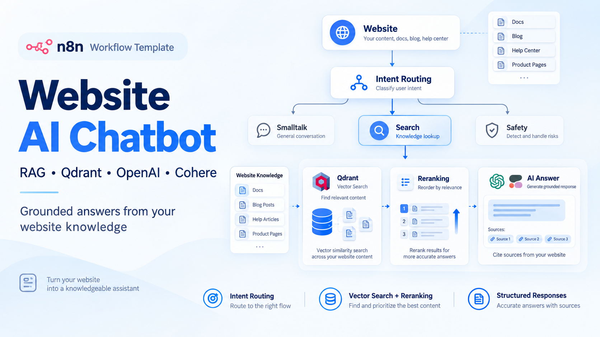

# Website AI Chatbot with RAG, Qdrant & Intent Routing



A production-oriented n8n workflow for building an AI chatbot that answers questions using your website's own content.

The workflow combines intent classification, safety routing, vector search with Qdrant, OpenAI embeddings, Cohere reranking, and structured AI-generated responses exposed through a webhook API.

<p align="center">
  <a href="https://paoloronco.gumroad.com/l/ai-website-chatbot" target="_blank">
    
  </a>
</p>

> **Paid template:** the workflow JSON is intentionally not included in this repository. It is delivered after purchase through Gumroad.

## Quick Overview

Turn your website content into an AI-powered knowledge chatbot.

The workflow classifies each incoming message, separates small talk and rejected requests from knowledge searches, retrieves relevant website content from Qdrant, reranks the results, and generates a structured response grounded only in the retrieved context.

## How It Works

- Receives chatbot messages through an authenticated webhook.
- Normalizes different incoming payload formats.
- Uses OpenAI to classify requests as `smalltalk`, `search`, or `reject`.
- Routes requests to the appropriate processing branch.
- Handles casual conversation separately from knowledge retrieval.
- Blocks out-of-scope, private, unsafe, or internal requests with a controlled response.
- Searches a Qdrant vector knowledge base for relevant website content.
- Generates query embeddings with OpenAI.
- Reranks retrieved documents with Cohere for improved relevance.
- Deduplicates and prepares the best sources as AI context.
- Generates a grounded answer using an AI Agent.
- Enforces a structured JSON response schema.
- Cleans and returns a frontend-friendly JSON response through the webhook.

## Workflow Architecture

```
Website / Frontend
       │
       ▼
Authenticated Webhook
       │
       ▼
Normalize Request
       │
       ▼
Intent Classification
       │
       ├── Reject ──────► Safety Response
       │
       ├── Smalltalk ───► AI Smalltalk Response
       │
       └── Search
             │
             ▼
        Qdrant Search
             │
      OpenAI Embeddings
             │
      Cohere Reranking
             │
             ▼
       Build Context
             │
             ▼
       AI Answer Agent
             │
             ▼
     Structured JSON Output
             │
             ▼
       Website / Frontend
```

## Setup

1. Purchase and download the workflow JSON from [Gumroad](https://paoloronco.gumroad.com/l/ai-website-chatbot).
2. Import the workflow JSON into n8n.
3. Configure the webhook authentication credentials.
4. Add your OpenAI credentials.
5. Configure your Qdrant instance and select your website knowledge collection.
6. Add your Cohere API credentials for reranking.
7. Select or adjust the OpenAI models used for classification, smalltalk, embeddings, and answer generation.
8. Review the prompts and adapt them to your website or use case.
9. Activate the workflow and connect your website or frontend to the production webhook URL.

## Requirements

- n8n
- OpenAI API account
- Qdrant instance
- A Qdrant collection containing your website knowledge
- Cohere API account for result reranking
- Website or frontend capable of calling the webhook endpoint

> **Note:** This template handles the chatbot query and response pipeline. Your website content must already be indexed in Qdrant. Website crawling, content ingestion, chunking, and synchronization are not included.

## Response Types

The workflow separates requests into three main paths:

### Knowledge Search

Questions related to your website are answered using retrieved knowledge rather than unrestricted model knowledge.

The final response can contain:
- Query
- Relevant results
- Original source URLs
- Short summaries
- Follow-up message

### Smalltalk

Greetings and casual conversation are handled separately so they do not trigger unnecessary vector searches.

### Rejected Requests

Unsafe, private, credential-related, internal, system-prompt, or unrelated requests receive a controlled response without accessing the knowledge retrieval pipeline.

## Grounded RAG Responses

The answer-generation agent is explicitly instructed to use only the context retrieved from the website knowledge base.

Retrieved documents are deduplicated by URL, ranked, converted into concise context, and passed to the final AI agent. This helps reduce hallucinations and keeps answers connected to actual website content.

## Structured Output

Knowledge responses follow a predictable JSON structure:

```json
{
  "type": "search_results",
  "query": "user question",
  "results": [
    {
      "title": "Page title",
      "url": "https://example.com/page",
      "summary": "Relevant answer or summary"
    }
  ],
  "follow_up": "Optional follow-up message"
}
```

This makes the workflow easier to integrate with custom chat interfaces, websites, dashboards, or other applications.

## Customization

You can adapt the workflow by changing:
- Intent classification rules
- Safety and rejection behavior
- Smalltalk personality
- OpenAI models
- Qdrant collection
- Retrieval depth
- Cohere reranking
- Context-building logic
- Answer-generation prompts
- Structured output schema
- Final webhook response format

## Use Cases

- Website AI chatbots
- Documentation assistants
- SaaS help centers
- Product knowledge assistants
- Customer self-service portals
- Internal knowledge bots
- Documentation search
- RAG-powered support experiences

## Purchase

The complete ready-to-import workflow is available on Gumroad:

**[Get the Website AI Chatbot workflow](https://paoloronco.gumroad.com/l/ai-website-chatbot)**
